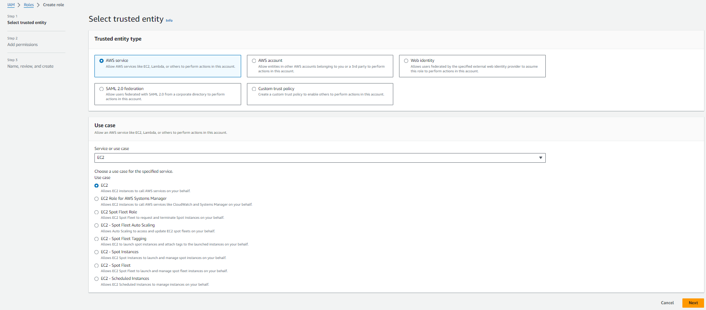
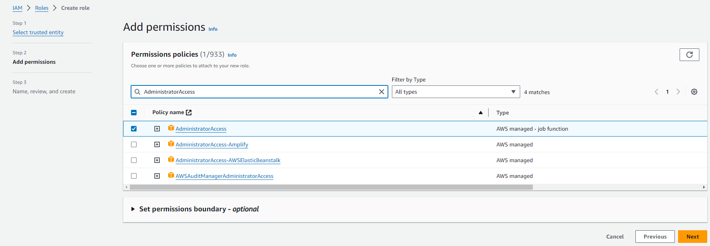
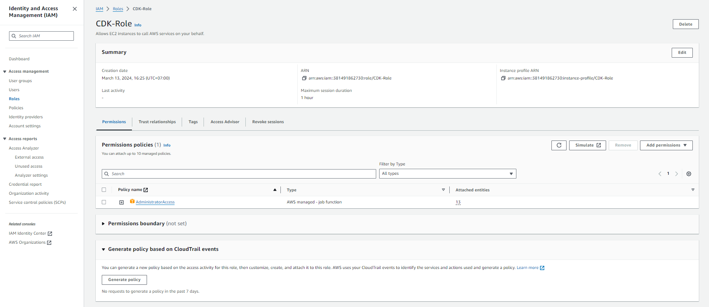

#### Create IAM Role

1. Access the [AWS Management Console] interface(https://aws.amazon.com/console/)
 
   - Find **IAM**
   - Select **IAM**

2. In the **IAM** interface

   - Select **Roles**
   - Select **Create role**

.png>)

3. In the **Select trusted entity** interface

   - Select **AWS service**
   - **Use case**, select **EC2**
   - Select **Next**

4. In the **Create role** interface

   - Find the policy **AdministratorAccess**
   - Select the policy **AdministratorAccess**
   - Select **Next**

5. In the **Role details** interface

   - **Role name**, enter `CDK-Role`

6. Select **Create role**

7. Complete role creation

