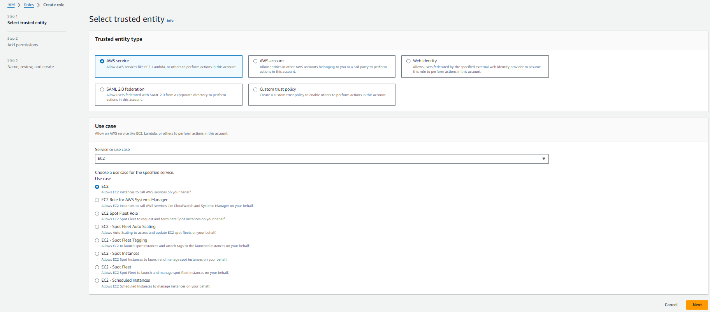
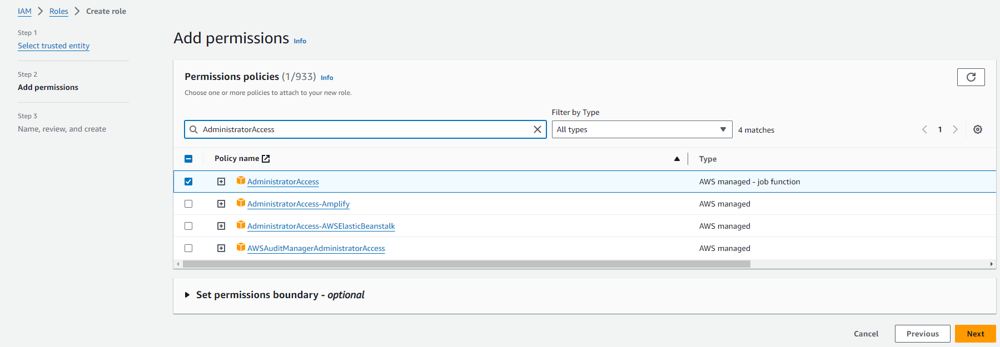
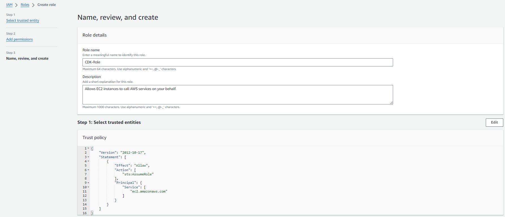
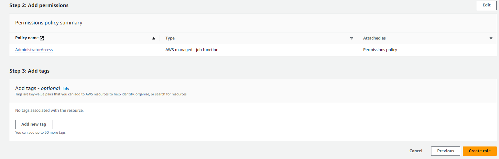
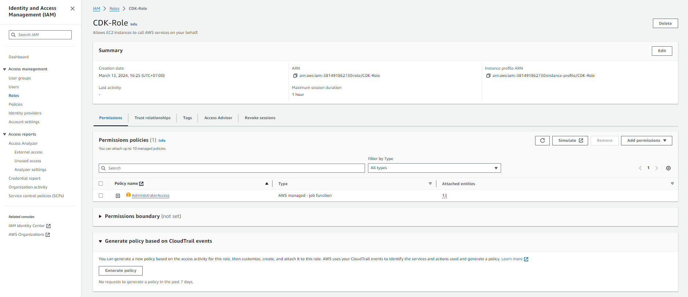

#### Tạo IAM Role

1. Truy cập giao diện [AWS Management Console](https://aws.amazon.com/console/)

   - Tìm **IAM**
   - Chọn **IAM**

2. Trong giao diện **IAM**

   - Chọn **Roles**
   - Chọn **Create role**

.png>)

3. Trong giao diện **Select trusted entity**

   - Chọn **AWS service**
   - **Use case**, chọn **EC2**
   - Chọn **Next**

4. Trong giao diện **Create role**

   - Tìm policy **AdministratorAccess**
   - Chọn policy **AdministratorAccess**
   - Chọn **Next**

5. Trong giao diện **Role details**

   - **Role name**, nhập `CDK-Role`

6. Chọn **Create role**

7. Hoàn thành tạo role

