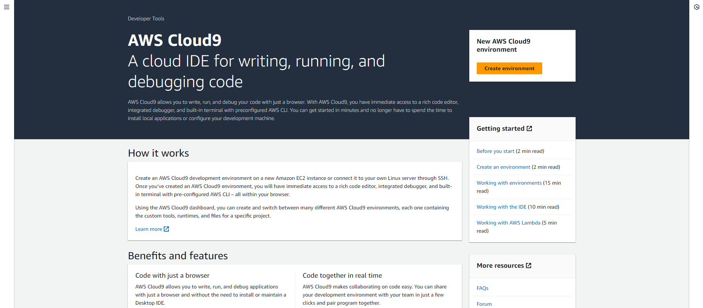
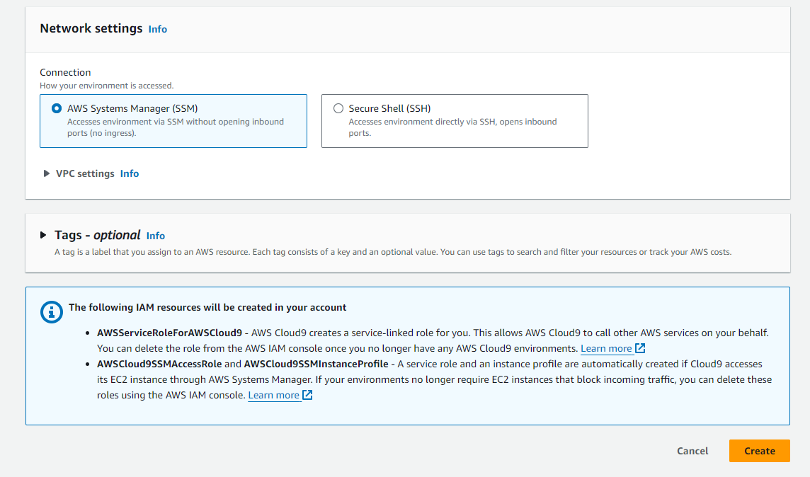
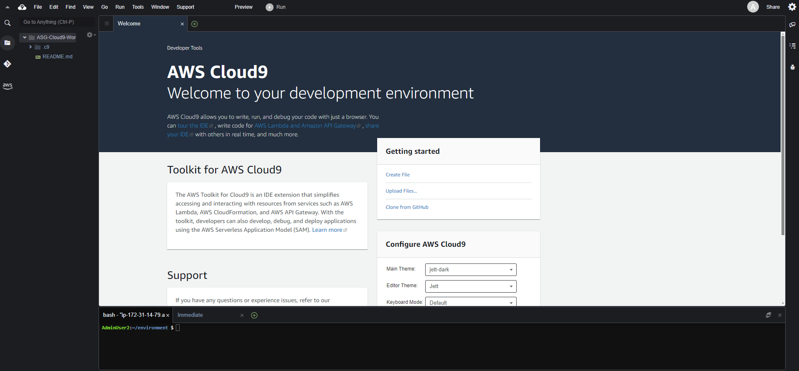

---
title : "Create workspace"
date : "`r Sys.Date()`"
weight : 1
chapter : false
pre : " <b> 3.1 </b> "
--- 
 
#### Create workspace
If you did the CloudFormation workshop, you can use the Cloud9 workspace created in that lab and skip the **first 6 steps* * of this section.

If not, you can continue with the following steps.

1. Access the [AWS Management Console] interface(https://aws.amazon.com/console/)

   - Find **Cloud9**
   - Select **Cloud9**

2. In the **AWS Cloud9** interface

   - Select **Create environment**

3. In the **Create environment** interface

   - **Name**, enter `ASG-Cloud9-Workshop`
   - **Environment type**, select **New EC2 instance**: EC2 Instance is initialized with the Cloud9 environment. The instance is accessed via Cloud9 IDE using the SSH method.
   - **Instance type**, select **t3.small(2GiB RAM + 2vCPU)**
   - **Platform**, select **Amazon Linux 2 (recommended)**
   - **Timeout**: after 30 minutes if EC2 Instance has no processes running, Cloud9 will stop Instance.
   - Leave the **Network** option as default (default VPC)

4. Select **Create**

5. Environment interface just initialized

