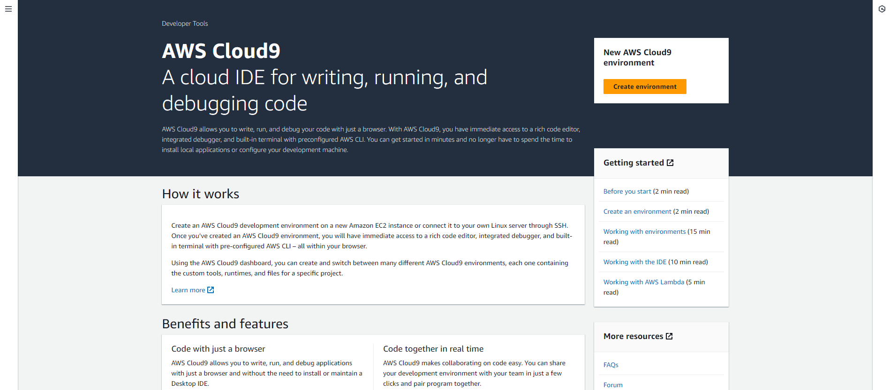
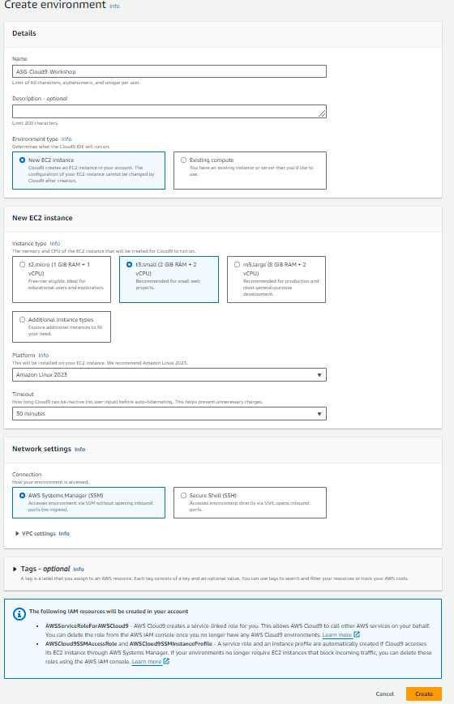
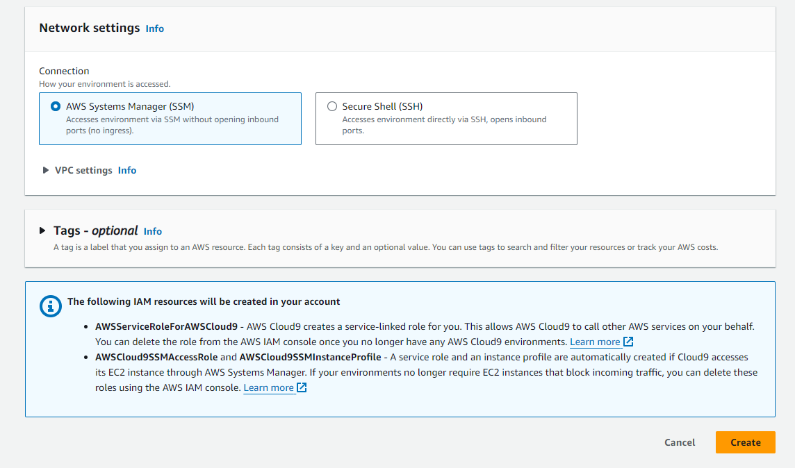
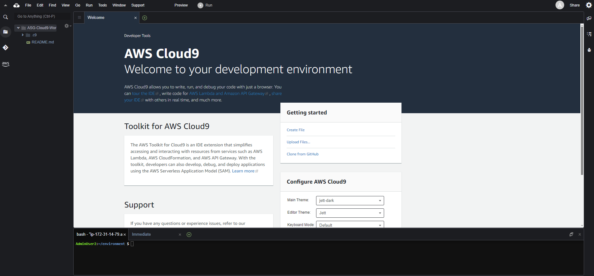

#### Tạo workspace
Nếu bạn đã làm [workshop về CloudFormation](https://000037.awsstudygroup.com/vi/1-introduce/), bạn có thể sử dụng Cloud9 workspace đã tạo trong bài lab đó và bỏ qua **6 bước đầu** của phần này.

Nếu không, bạn có thể tiếp tục với các bước sau đây.

1. Truy cập vào giao diện [AWS Management Console](https://aws.amazon.com/console/)

   - Tìm **Cloud9**
   - Chọn **Cloud9**

2. Trong giao diện **AWS Cloud9**

   - Chọn **Create environment**

3. Trong giao diện **Create environment**

   - **Name**, nhập `ASG-Cloud9-Workshop`
   - **Environment type**, chọn **New EC2 instance**: EC2 Instance được khởi tạo cùng với Cloud9 environment. Instance được truy cập qua Cloud9 IDE sử dụng phương thức SSH. 
   - **Instance type**, chọn **t3.small(2GiB RAM + 2vCPU)**
   - **Platform**, chọn **Amazon Linux 2023 (Recommended)**
   - **Timeout**: sau 30’ nếu EC2 Instance không có tiến trình nào được chạy, Cloud9 sẽ stop Instance.
   - Để tuỳ chọn **Network** theo như mặc định (default VPC)

4. Chọn **Create**

5. Giao diện môi trường vừa khởi tạo

