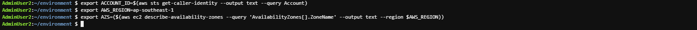

 
#### Configure Cloud9 environment

1. In the environment interface just initialized

   - Select the circular user icon in the right corner of the screen, next to **Share**
   - Select **Manage EC2 Instance**


2. In the **EC2** interface

   - Select **Action**
   - Select **Security**
   - Select **Modify IAM role**

.png>)

3. In the **Modify IAM role** interface

   - Select the created role, this lab choose **CDK-Role**
   - Select **Update IAM role**

.png>)

4. Completed the role assignment successfully.


5. In the view of the **AWS Cloud9** environment

   - Select **Icon Cloud9**
   - Select **Preferences**

.png>)

6. Cloud9 will manage IAM credentials automatically. We will need to disable this feature and use the IAM Role.

   - Select **AWS SETTINGS**
   - Uncheck **AWS managed temporary credentials**


7. Copy and Paste the command below into the Terminal of Cloud9 Workspace to install tools to support text processing on the command line.
 
```
sudo yum -y install jq gettext bash-completion
```

8. Similar to CloudFormation, you can install the cfn-lint tool to help you check CDK templates and other information, including auditing.
Check if the resource properties are correct or not
configured according to best practices or not.

```
pip install cfn-lint
```


9. Check the successful installation of cfn-lint using the following command:

```
cfn-lint --version
```


10. We will configure the aws cli to use the current Region.

```
export ACCOUNT_ID=<Your Account ID>
export AWS_REGION=<Your AWS Region>
export AZS=($(aws ec2 describe-availability-zones --query 'AvailabilityZones[].ZoneName' --output text --region $AWS_REGION))
```



11. We will save the configuration information to bash_profile

```
echo "export ACCOUNT_ID=${ACCOUNT_ID}" | tee -a ~/.bash_profile

echo "export AWS_REGION=${AWS_REGION}" | tee -a ~/.bash_profile

echo "export AZS=(${AZS[@]})" | tee -a ~/.bash_profile

aws configure set default.region ${AWS_REGION}
```


12. Check if CLI CDK is installed by running the command.

```
cdk --version
```


13. We will use the command to check if the Cloud9 IDE is using the IAM Role correctly.

```
aws sts get-caller-identity --query Arn | grep CDK-Role -q && echo "IAM role valid" || echo "IAM role NOT valid"
```