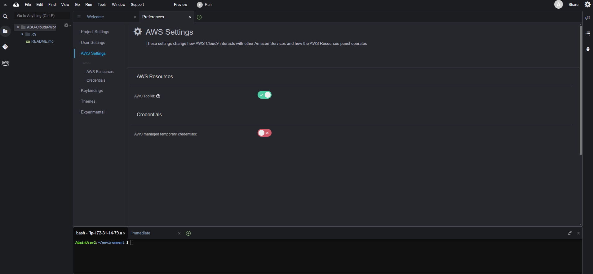

 
#### Cấu hình môi trường Cloud9

1. Trong giao diện môi trường vừa khởi tạo

   - Chọn biểu tượng user hình tròn ở góc phải màn hình, bên cạnh **Share**
   - Chọn **Manage EC2 Instance**


2. Trong giao diện **EC2**

   - Chọn **Action**
   - Chọn **Security**
   - Chọn **Modify IAM role**

.png>)

3. Trong giao diện **Modify IAM role**

   - Chọn role đã tạo, bài lab này chọn **CDK-Role**
   - Chọn **Update IAM role**

.png>)

4. Hoàn thành gán role thành công.


5. Trong giao diện của môi trường **AWS Cloud9**

   - Chọn **Icon của Cloud9**
   - Chọn **Preferences**


6. Cloud9 sẽ quản lý thông tin chứng thực IAM một cách tự động. Chúng ta sẽ cần phải vô hiệu hóa tính năng này và sử dụng IAM Role.

   - Chọn **AWS SETTINGS**
   - Bỏ chọn **AWS managed temporary credentials**



7. Copy và Paste đoạn lệnh dưới đây vào Terminal của Cloud9 Workspace để cài đặt các công cụ hỗ trợ xử lý text trên dòng lệnh.

```
sudo yum -y install jq gettext bash-completion 
```

8. Tương tự như CloudFormation, bạn có thể thực hiện cài đặt tool cfn-lint để giúp bạn kiểm tra CDK templates và các thông tin khác, bao gồm kiểm
tra các thuộc tính của tài nguyên đã chính xác hay chưa hoặc thông tin
cấu hình đã theo best practices hay chưa.

```
pip install cfn-lint
```


9. Kiểm tra cài đặt cfn-lint thành công bằng cách dùng lệnh sau:

```
cfn-lint --version
```


10. Chúng ta sẽ cấu hình aws cli sử dụng Region hiện tại.

```
export ACCOUNT_ID=$(aws sts get-caller-identity --output text --query Account)
export AWS_REGION=ap-southeast-1
export AZS=($(aws ec2 describe-availability-zones --query 'AvailabilityZones[].ZoneName' --output text --region $AWS_REGION))
```


11. Chúng ta sẽ lưu các thông tin cấu hình vào bash_profile

```
echo "export ACCOUNT_ID=${ACCOUNT_ID}" | tee -a ~/.bash_profile 

echo "export AWS_REGION=${AWS_REGION}" | tee -a ~/.bash_profile                                                                                                                           

echo "export AZS=(${AZS[@]})" | tee -a ~/.bash_profile                                                                                                                                    

aws configure set default.region ${AWS_REGION}
```


12. Kiểm tra xem CLI CDK đã được cài đặt chưa bằng cách chạy lệnh.

```
cdk --version
```


13. Chúng ta sẽ sử dụng câu lệnh để kiểm tra Cloud9 IDE đang sử dụng IAM Role có chính xác không.

```
aws sts get-caller-identity --query Arn | grep CDK-Role -q && echo "IAM role valid" || echo "IAM role NOT valid"
```