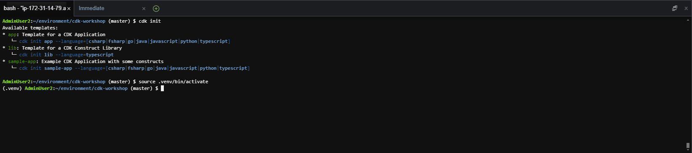

 
#### Create CDK Template

We will work with the CDK mainly through the AWS CDK Toolkit (the tool was installed in the previous section). The AWS CDK Toolkit will run your code, generate a CloudFormation template, and deploy that template. The CDK Toolkit provides users with the ability to deploy, compare, remove, and debug a piece of CDK code. Refer to [official AWS documentation on CDK](https://docs.aws.amazon.com/cdk/v2/guide/cli.html)

In this section, we will try to implement a VPC and corresponding public subnet, using Python in CDK

1. Access the created Cloud9 workspace.

- Create a new folder for the lab

```
mkdir cdk-workshop
cd cdk-workshop
```


2. Initialize the workspace cdk. In this lab, we will use `python` language, but you can completely edit it into Typescript, Javascript, Java or C#

```
cdk init app --language python
```
Once it's run, you can take a look at the directory architecture that has just been initialized. Pay attention to the two main files [app.py]() and `cdk_workshop/cdk_workshop_stack.py`


3. Import the required libraries in the file `cdk_workshop/cdk_workshop_stack.py`

```
from aws_cdk import (
    Stacks,
    aws_ec2 as ec2,
    aws_iam as iam
)
from aws_cdk.aws_s3_assets import Asset
import os
from constructs import Construct
```

In the file `cdk_workshop/cdk_workshop_stack.py`, declare 1 VPC and 2 public subnets located in the VPC by adding the following code to the `__init__` function

```
# VPC

vpc = ec2.Vpc(self, "CDK-Workshop-App-VPC",
    nat_gateways=0,
    subnet_configuration=[ec2.SubnetConfiguration(name="public",subnet_type=ec2.SubnetType.PUBLIC)]
    )
```


4. You can use the following command to initialize the project and combine the activation of the environment for the project.

```
cdk init
```

- To activate the environment to avoid the error of running project.

```
source .venv/bin/activate
```



5. After activating the environment, we need to install the basic dependencies (in this lab, we install the Python dependencies)

```
python -m pip install -r requirements.txt
```


6. Check **CloudFormation**


7. Test **S3 bucket**


8. If this is your first time deploying the CDK, bootstrap the app by running the following command

```
cdk bootstrap
```


On the first run, we will need to **bootstrap** the CDK application. This bootstrap will

- Create a new CloudFormation stack and a corresponding S3 bucket to hold assets for this stack (like Lambda function code, CloudFormation template)
- Create the necessary IAM roles so that the CDK CLI can deploy the resources

9. Resource Deployment

```
cdk deploy
```

The above command is equivalent to running cdk deploy --app ./app.py. When run, the code in the app.py file will be called. This code will import resources from cdk_workshop/cdk_workshop_stack.py, and generate the corresponding CloudFormation template in the cdk.out folder. This CloudFormation template will then be deployed on AWS.


10. Once deployed, you will see the newly created CloudFormation stack in the CloudFormation dashboard


11. You can also see the VPC and 2 new public subnets created in the VPC dashboard


If you've made it to this step, congratulations on successfully deploying your AWS resources through the CDK!

In the next section, we will use the created VPC and subnet to deploy an EC2 server and install Apache server on it. We will also get acquainted with some other features of the CDK such as generating CloudFormation configuration from CDK using `cdk synch` or checking ChangeSet using `cdk diff`