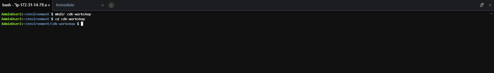
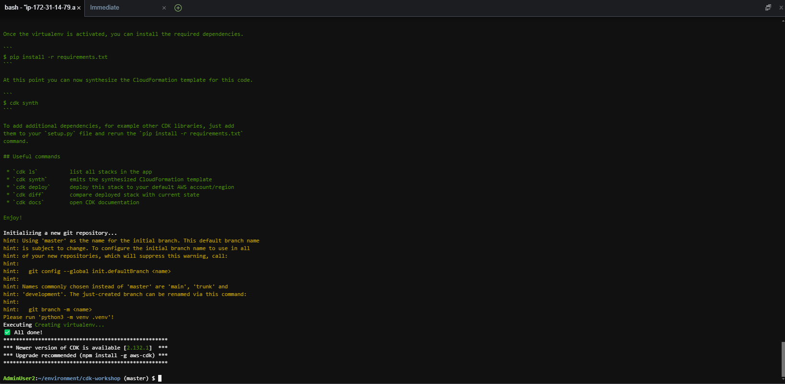
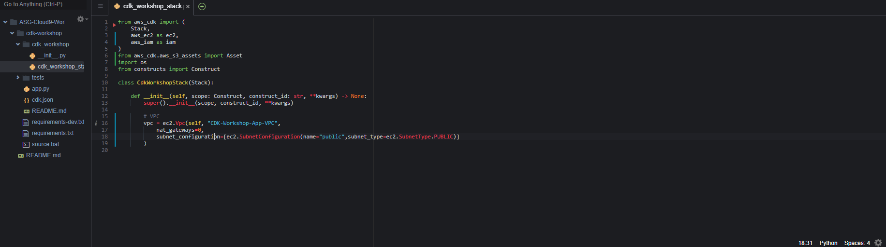
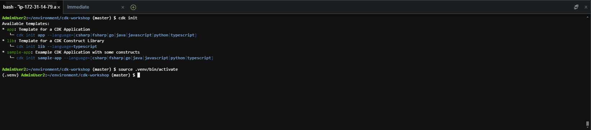
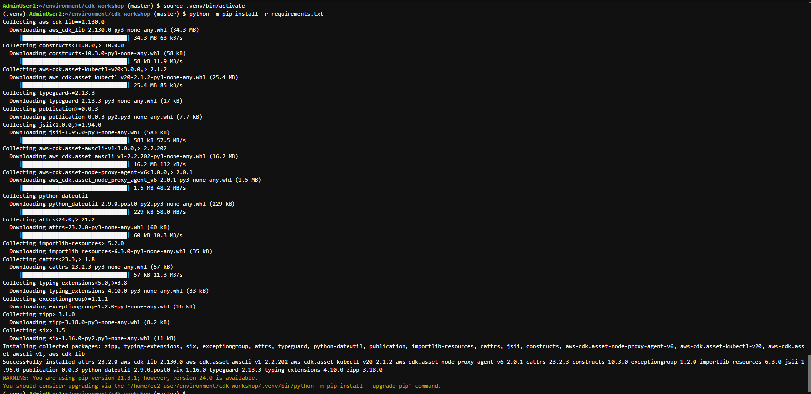
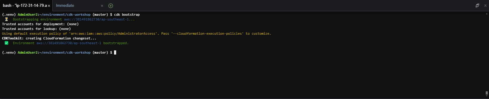
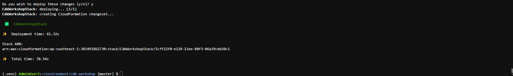

#### Tạo CDK Template

Chúng ta sẽ thao tác với CDK chủ yếu qua AWS CDK Toolkit (công cụ đã được cài đặt ở phần trước). AWS CDK Toolkit sẽ chạy code của bạn, sinh ra 1 template CloudFormation và triển khai template đó. CDK Toolkit cung cấp cho người dùng khả năng có thể triển khai, so sánh, xoá và tìm lỗi trong một đoạn mã CDK. Tham khảo [tài liệu chính thức của AWS về CDK](https://docs.aws.amazon.com/cdk/v2/guide/cli.html)

Trong phần này, chúng ta sẽ thử triển khai một VPC và public subnet tương ứng, sử dụng Python trong CDK

1. Truy cập vào workspace Cloud9 đã tạo.

- Tạo thư mục mới cho bài lab

```
mkdir cdk-workshop
cd cdk-workshop
```



2. Khởi tạo cdk workspace. Ở bài lab này, chúng ta sẽ sử dụng ngôn ngữ `python`, tuy nhiên bạn hoàn toàn có thể chỉnh sửa thành Typescript, Javascript, Java hoặc C#

```
cdk init app --language python
```
Sau khi chạy xong, bạn có thể xem qua kiến trúc thư mục vừa được khởi tạo. Chú ý đến 2 file chính là [app.py]() và `cdk_workshop/cdk_workshop_stack.py`



3. Import các thư viện cần thiết trong file `cdk_workshop/cdk_workshop_stack.py`

```
from aws_cdk import (
    Stack,
    aws_ec2 as ec2,
    aws_iam as iam
)
from aws_cdk.aws_s3_assets import Asset
import os
from constructs import Construct
```

Trong file `cdk_workshop/cdk_workshop_stack.py`, khai báo 1 VPC và 2 public subnet nằm trong VPC bằng việc thêm đoạn mã sau vào hàm `__init__`

```
# VPC

vpc = ec2.Vpc(self, "CDK-Workshop-App-VPC",
    nat_gateways=0,
    subnet_configuration=[ec2.SubnetConfiguration(name="public",subnet_type=ec2.SubnetType.PUBLIC)]
    )
```



4. Bạn có thể sử dụng lệnh sau để khởi tạo project và kết hợp kích hoạt môi trường cho project.

```
cdk init
```

- Để kích hoạt môi trường để tránh trường hợp chạy lỗi project.

```
source .venv/bin/activate
```



5. Sau khi đã kích hoạt môi trường, chúng ta cần cài đặt các dependency cơ bản ( trong lab này, chúng ta cài đặt các dependency của Python)

```
python -m pip install -r requirements.txt
```



6. Kiểm tra **CloudFormation**


7. Kiểm tra **S3 bucket**


8. Nếu đây là lần đầu tiên bạn triển khai CDK, hãy bootstrap app bằng cách chạy lệnh sau

```
cdk bootstrap
```



Trong lần chạy đầu tiên, chúng ta sẽ cần phải **bootstrap** ứng dụng CDK. Việc bootstrap này sẽ 

- Tạo một CloudFormation stack mới và một S3 bucket tương ứng để chứa các asset cho stack này (như code của Lambda function, CloudFormation template)
- Tạo các IAM role cần thiết để CDK CLI có thể triển khai các tài nguyên

9. Triển khai tài nguyên

```
cdk deploy
```

Lệnh trên tương đương với việc chạy cdk deploy --app ./app.py. Khi chạy, code trong file app.py sẽ được gọi. Đoạn code này sẽ import tài nguyên từ cdk_workshop/cdk_workshop_stack.py, và sinh ra CloudFormation template tương ứng trong thư mục cdk.out. Sau đó, CloudFormation template này sẽ được triển khai trên AWS.



10. Sau khi triển khai xong, bạn sẽ thấy CloudFormation stack mới được tạo ở trong CloudFormation dashboard


11. Bạn cũng có thể thấy VPC và 2 public subnet mới đã được tạo trong dashboard VPC


Nếu bạn đã làm đến bước này, chúc mừng bạn đã triển khai thành công resource của AWS thông qua CDK! 

Ở phần tiếp theo, chúng ta sẽ sử dụng VPC và subnet đã tạo để triển khai một máy chủ EC2 và cài đặt Apache server trên máy chủ đó. Chúng ta cũng sẽ làm quen với một vài tính năng khác của CDK như sinh cấu hình CloudFormation từ CDK sử dụng `cdk synch` hoặc kiểm tra ChangeSet sử dụng `cdk diff`


