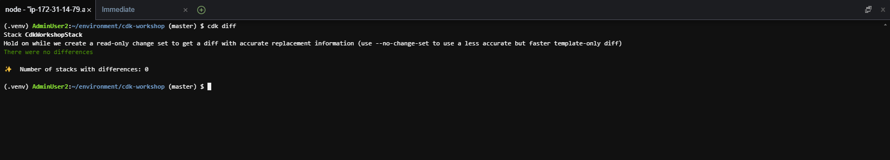
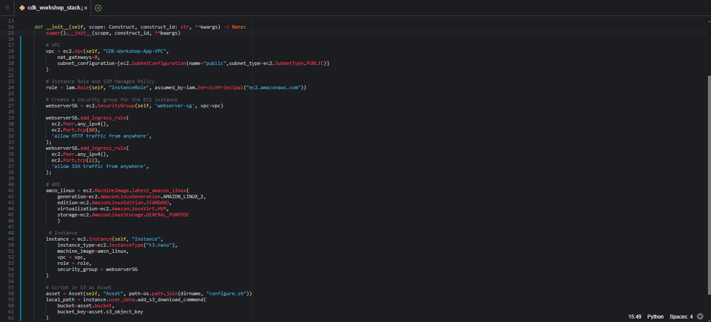
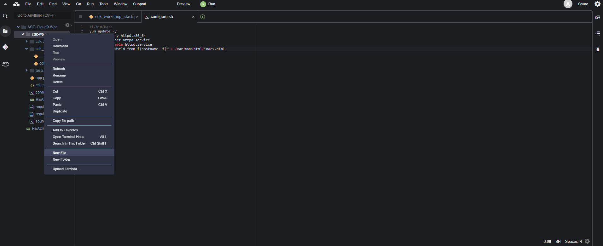
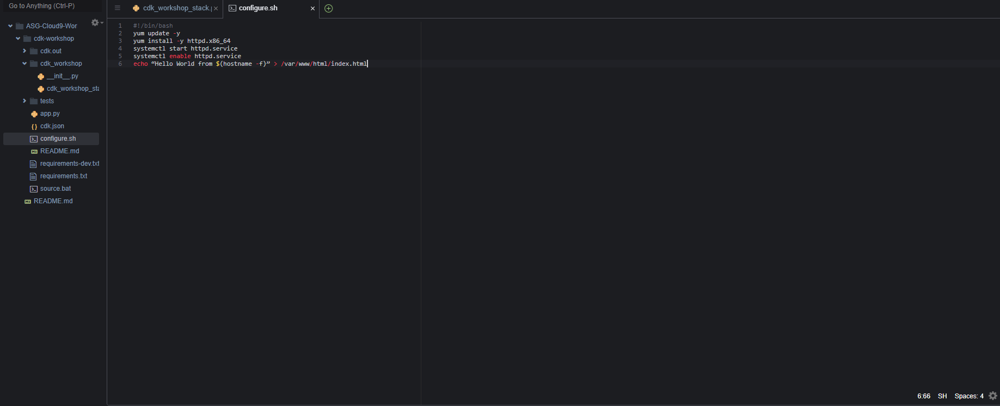
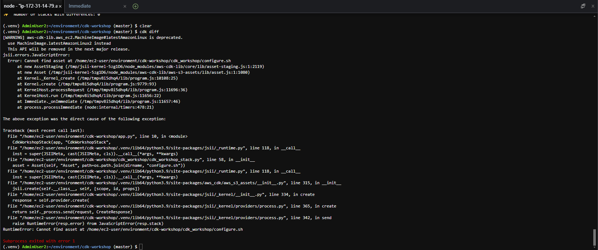
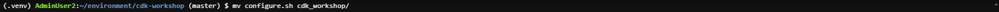
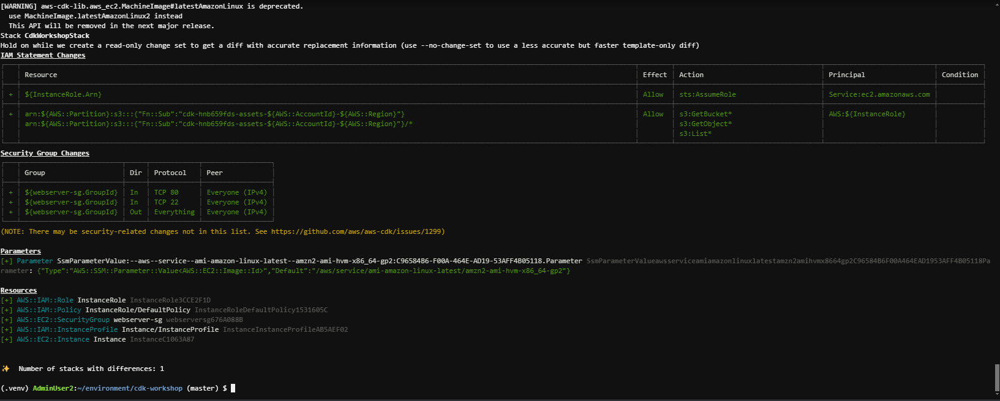
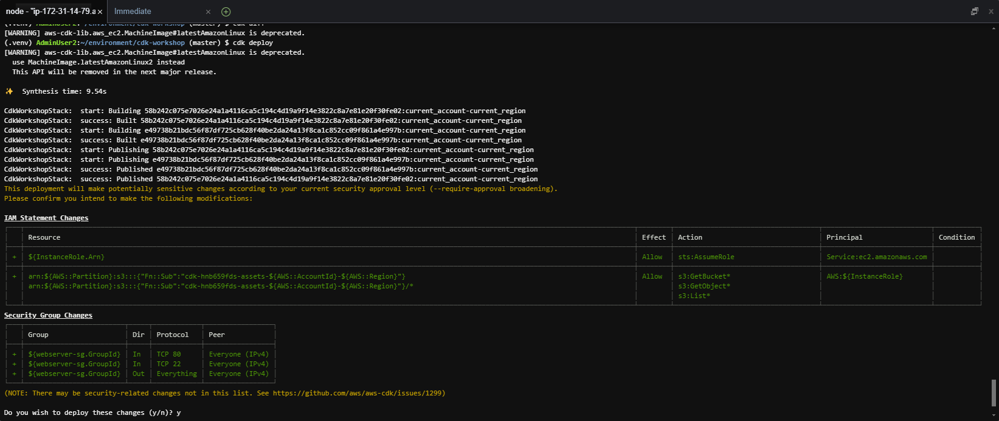
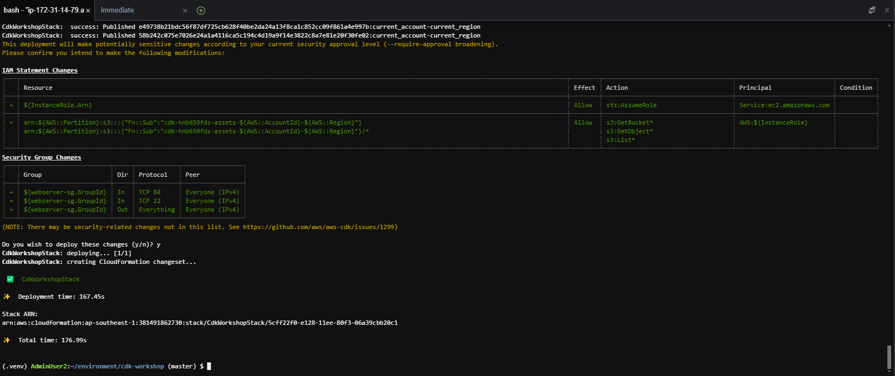

 
#### Update CDK Template

In this section, we will use the created VPC and subnet to deploy an EC2 server and install the Apache server on it.

1. Before updating the CDK code, we will try to check the changed resources (ChangeSet) by running the command

```
cdk diff
```

In the background, this command will do 2 things

- Run `cdk synth` to generate a valid CloudFormation template into the `cdk.out` directory.
- Compare the resources in this template with the existing resources on the deployed CloudFormation Stack

The result will be a ChangeSet between the existing CDK instance and the CDK instance deployed on AWS. Here, we haven't changed anything, so the result will be as follows



2. Add the new role to the stack by adding the following code to the __init__() function of the file cdk_workshop/cdk_workshop_stack.py

```
# Instance Role and SSM Managed Policy
role = iam.Role(self, "InstanceRole", assumed_by=iam.ServicePrincipal("ec2.amazonaws.com"))
```

3. Add security group web server to allow access from port 80


```
# Create a security group for the EC2 instance
webserverSG = ec2.SecurityGroup(self, 'webserver-sg', vpc=vpc)
    
webserverSG.addIngressRule(
		ec2.Peer.anyIpv4(),
    ec2.Port.tcp(80),
    'allow HTTP traffic from anywhere',
)
```

4. Initialize EC2 server and assign created role as service role

```
# AMI
amzn_linux = ec2.MachineImage.latest_amazon_linux(
            generation=ec2.AmazonLinuxGeneration.AMAZON_LINUX_2,
            edition=ec2.AmazonLinuxEdition.STANDARD,
            virtualization=ec2.AmazonLinuxVirt.HVM,
            storage=ec2.AmazonLinuxStorage.GENERAL_PURPOSE
            )

# Instance
instance = ec2.Instance(self, "Instance",
						instance_type=ec2.InstanceType("t3.nano"),
            machine_image=amzn_linux,
            vpc = vpc,
            role = role,
						security_group = webserverSG
						)
```

5. Add user data to the EC2 server

```
...
dirname = os.path.dirname(__file__)
...

class CdkWorkshopStack(Stack):
		def __init__(self, scope: Construct, construct_id: str, **kwargs) -> None:
				...
				# Script in S3 as Asset
				asset = Asset(self, "Asset", path=os.path.join(dirname, "configure.sh"))
				
				local_path = instance.user_data.add_s3_download_command(
				            bucket=asset.bucket,
				            bucket_key=asset.s3_object_key
						        )
				
				# Userdata executes script from 
				instance.user_data.add_execute_file_command(
										file_path=local_path
				            )
				asset.grant_read(instance.role)
			
```
6. Check file contents


```
from aws_cdk import (
    Stack,
    aws_ec2 as ec2,
    aws_iam as iam
)
from aws_cdk.aws_s3_assets import Asset
import os
from constructs import Construct

dirname = os.path.dirname(__file__)

class CdkWorkshopStack(Stack):

    def __init__(self, scope: Construct, construct_id: str, **kwargs) -> None:
        super().__init__(scope, construct_id, **kwargs)
        
        # VPC
        vpc = ec2.Vpc(self, "CDK-Workshop-App-VPC",
            nat_gateways=0,
            subnet_configuration=[ec2.SubnetConfiguration(name="public",subnet_type=ec2.SubnetType.PUBLIC)]
        )
        
        # Instance Role and SSM Managed Policy
        role = iam.Role(self, "InstanceRole", assumed_by=iam.ServicePrincipal("ec2.amazonaws.com"))
        
        # Create a security group for the EC2 instance
        webserverSG = ec2.SecurityGroup(self, 'webserver-sg', vpc=vpc)
    
        webserverSG.add_ingress_rule(
          ec2.Peer.any_ipv4(),
          ec2.Port.tcp(80),
          'allow HTTP traffic from anywhere',
        );
        webserverSG.add_ingress_rule(
          ec2.Peer.any_ipv4(),
          ec2.Port.tcp(22),
          'allow SSH traffic from anywhere',
        );
        
        # AMI
        amzn_linux = ec2.MachineImage.latest_amazon_linux(
            generation=ec2.AmazonLinuxGeneration.AMAZON_LINUX_2,
            edition=ec2.AmazonLinuxEdition.STANDARD,
            virtualization=ec2.AmazonLinuxVirt.HVM,
            storage=ec2.AmazonLinuxStorage.GENERAL_PURPOSE
            )
        
         # Instance
        instance = ec2.Instance(self, "Instance",
            instance_type=ec2.InstanceType("t3.nano"),
            machine_image=amzn_linux,
            vpc = vpc,
            role = role,
            security_group = webserverSG
        )
            
        # Script in S3 as Asset
        asset = Asset(self, "Asset", path=os.path.join(dirname, "configure.sh"))
        local_path = instance.user_data.add_s3_download_command(
            bucket=asset.bucket,
            bucket_key=asset.s3_object_key
        )

        # Userdata executes script from S3
        instance.user_data.add_execute_file_command(
            file_path=local_path
            )
        asset.grant_read(instance.role)
```



7. Create the configure.sh file to store the initialization code for the EC2 instance. This initialization code will update the software and install the apache server on our instance




8. Add the following code:


```
#!/bin/bash
yum update -y
yum install -y httpd.x86_64
systemctl start httpd.service
systemctl enable httpd.service
echo “Hello World from $(hostname -f)” > /var/www/html/index.html
```



9. Run the command cdk diff to see the change of the stack we just defined

```
cdk diff
```

Oh no, something went wrong. Looking at the log, you can see that the link of the asset file is wrong. We can see that `cdk` provides us with error handling, just like `taskcat` with CloudFormation.




10. To fix it, we just need to put the file `[configure.sh](http://configure.sh)` in the right place. From the path `~/environment/cdk-workshop`, run the following command

```
mv configure.sh cdk_workshop/
```



11. Rerun cdk diff . command

```
cdk diff
```



Template changes have been displayed

12. Deploy to AWS

```
cdk deploy
```

- Select y to continue



13. Complete Deployment



14. Access EC2 dashboard window, get Public IP information of EC2 instance


15. If you see text display from apache then setup was successful

