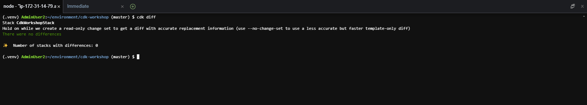
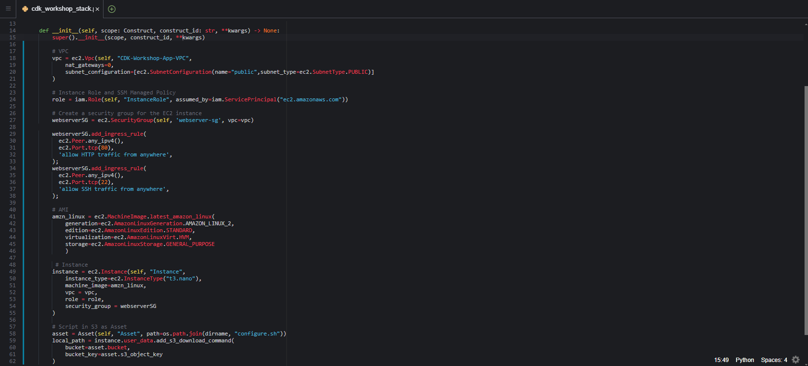
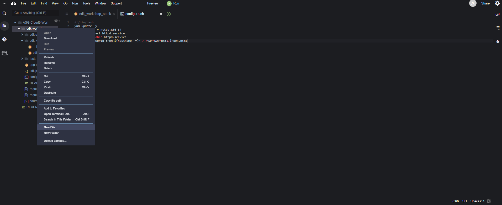
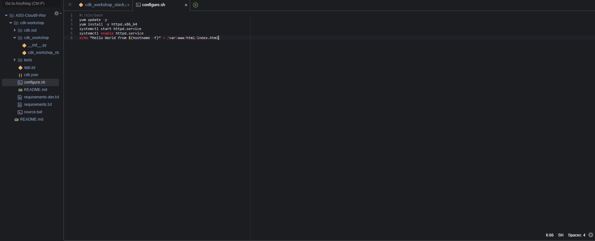
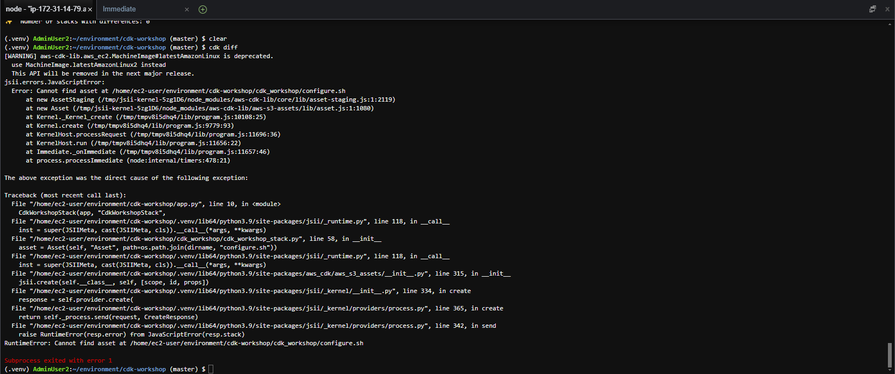
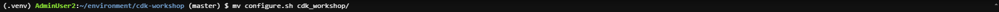
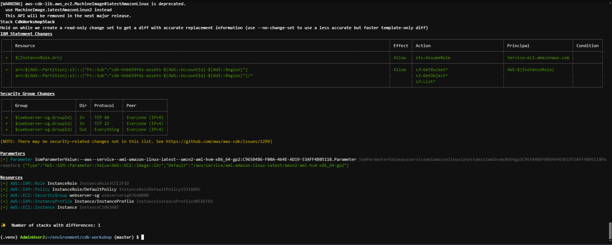
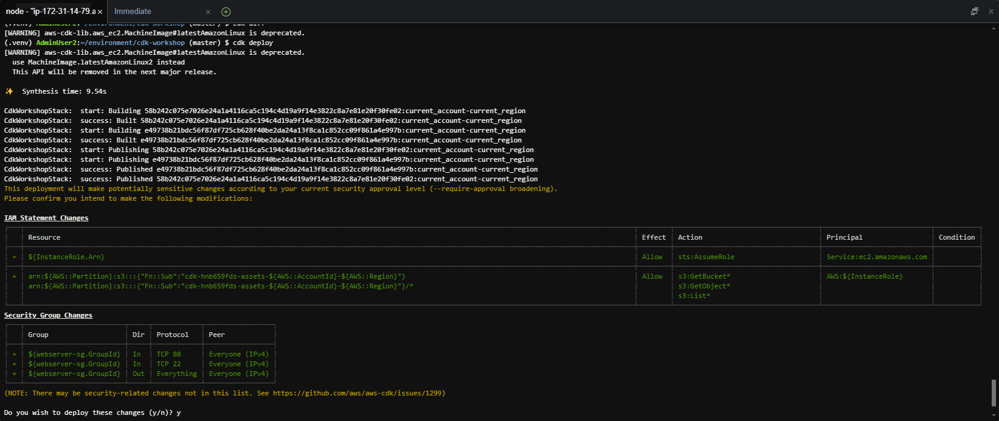
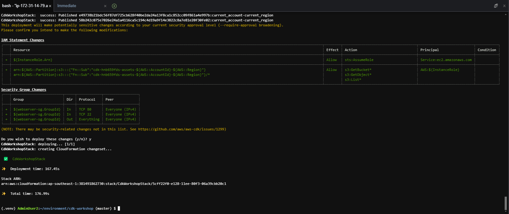

#### Cập nhật CDK Template

Trong phần này, chúng ta sẽ sử dụng VPC và subnet đã tạo để triển khai một máy chủ EC2 và cài đặt Apache server trên máy chủ đó.

1. Trước khi cập nhật code CDK, chúng ta sẽ thử kiểm tra các tài nguyên đã thay đổi (ChangeSet) bằng cách chạy lệnh

```
cdk diff
```

Ở đằng sau, lệnh này sẽ thực hiện 2 thứ

- Chạy `cdk synth` để sinh ra một template CloudFormation hợp lệ vào thư mục `cdk.out`
- So sánh các tài nguyên trong template này với các tài nguyên hiện có trên CloudFormation Stack đã được triển khai

Kết quả sẽ là ChangeSet giữa phiên bản CDK đang có và phiên bản CDK được triển khai trên AWS. Ở đây, chúng ta chưa thay đổi gì, nên kết quả sẽ được như sau



2. Thêm role mới vào stack bằng việc thêm đoạn code sau vào hàm __init__() của file cdk_workshop/cdk_workshop_stack.py

```
# Instance Role and SSM Managed Policy
role = iam.Role(self, "InstanceRole", assumed_by=iam.ServicePrincipal("ec2.amazonaws.com"))
```

3. Thêm security group web server để cho phép access từ port 80


```
# Create a security group for the EC2 instance
webserverSG = ec2.SecurityGroup(self, 'webserver-sg', vpc=vpc)
    
webserverSG.addIngressRule(
		ec2.Peer.anyIpv4(),
    ec2.Port.tcp(80),
    'allow HTTP traffic from anywhere',
)
```

4. Khởi tạo máy chủ EC2 và gán role đã tạo làm service role

```
# AMI
amzn_linux = ec2.MachineImage.latest_amazon_linux(
            generation=ec2.AmazonLinuxGeneration.AMAZON_LINUX_2,
            edition=ec2.AmazonLinuxEdition.STANDARD,
            virtualization=ec2.AmazonLinuxVirt.HVM,
            storage=ec2.AmazonLinuxStorage.GENERAL_PURPOSE
            )

# Instance
instance = ec2.Instance(self, "Instance",
						instance_type=ec2.InstanceType("t3.nano"),
            machine_image=amzn_linux,
            vpc = vpc,
            role = role,
						security_group = webserverSG
						)
```


5. Thêm user data cho máy chủ EC2


```
...
dirname = os.path.dirname(__file__)
...

class CdkWorkshopStack(Stack):
		def __init__(self, scope: Construct, construct_id: str, **kwargs) -> None:
				...
				# Script in S3 as Asset
				asset = Asset(self, "Asset", path=os.path.join(dirname, "configure.sh"))
				
				local_path = instance.user_data.add_s3_download_command(
				            bucket=asset.bucket,
				            bucket_key=asset.s3_object_key
						        )
				
				# Userdata executes script from 
				instance.user_data.add_execute_file_command(
										file_path=local_path
				            )
				asset.grant_read(instance.role)
			
```

6. Kiểm tra nội dung file


```
from aws_cdk import (
    Stack,
    aws_ec2 as ec2,
    aws_iam as iam
)
from aws_cdk.aws_s3_assets import Asset
import os
from constructs import Construct

dirname = os.path.dirname(__file__)

class CdkWorkshopStack(Stack):

    def __init__(self, scope: Construct, construct_id: str, **kwargs) -> None:
        super().__init__(scope, construct_id, **kwargs)
        
        # VPC
        vpc = ec2.Vpc(self, "CDK-Workshop-App-VPC",
            nat_gateways=0,
            subnet_configuration=[ec2.SubnetConfiguration(name="public",subnet_type=ec2.SubnetType.PUBLIC)]
        )
        
        # Instance Role and SSM Managed Policy
        role = iam.Role(self, "InstanceRole", assumed_by=iam.ServicePrincipal("ec2.amazonaws.com"))
        
        # Create a security group for the EC2 instance
        webserverSG = ec2.SecurityGroup(self, 'webserver-sg', vpc=vpc)
    
        webserverSG.add_ingress_rule(
          ec2.Peer.any_ipv4(),
          ec2.Port.tcp(80),
          'allow HTTP traffic from anywhere',
        );
        webserverSG.add_ingress_rule(
          ec2.Peer.any_ipv4(),
          ec2.Port.tcp(22),
          'allow SSH traffic from anywhere',
        );
        
        # AMI
        amzn_linux = ec2.MachineImage.latest_amazon_linux(
            generation=ec2.AmazonLinuxGeneration.AMAZON_LINUX_2,
            edition=ec2.AmazonLinuxEdition.STANDARD,
            virtualization=ec2.AmazonLinuxVirt.HVM,
            storage=ec2.AmazonLinuxStorage.GENERAL_PURPOSE
            )
        
         # Instance
        instance = ec2.Instance(self, "Instance",
            instance_type=ec2.InstanceType("t3.nano"),
            machine_image=amzn_linux,
            vpc = vpc,
            role = role,
            security_group = webserverSG
        )
            
        # Script in S3 as Asset
        asset = Asset(self, "Asset", path=os.path.join(dirname, "configure.sh"))
        local_path = instance.user_data.add_s3_download_command(
            bucket=asset.bucket,
            bucket_key=asset.s3_object_key
        )

        # Userdata executes script from S3
        instance.user_data.add_execute_file_command(
            file_path=local_path
            )
        asset.grant_read(instance.role)
```



7. Tạo file configure.sh để lưu mã khởi tạo cho instance EC2. Mã khởi tạo này sẽ cập nhật phần mềm và cài đặt apache server lên instance của chúng ta




8. Thêm đoạn mã sau:


```
#!/bin/bash
yum update -y
yum install -y httpd.x86_64
systemctl start httpd.service
systemctl enable httpd.service
echo “Hello World from $(hostname -f)” > /var/www/html/index.html
```



9. Chạy lệnh cdk diff để xem sự thay đổi của stack chúng ta mới định nghĩa

```
cdk diff 
```

Ôi không, đã có lỗi xảy ra. Nhìn vào log, bạn có thể thấy rằng đường link của file asset đã bị sai. Chúng ta có thể thấy `cdk` cung cấp cho ta khả năng kiểm soát lỗi, cũng giống như `taskcat` với CloudFormation.




10. Để sửa lại, chúng ta chỉ cần đưa file `[configure.sh](http://configure.sh)` về đúng vị trí. Từ đường dẫn `~/environment/cdk-workshop`, chạy lệnh sau

```
mv configure.sh cdk_workshop/
```



11. Chạy lại lệnh cdk diff 

```
cdk diff
```



Các thay đổi của template đã được hiển thị

12. Triển khai lên AWS

```
cdk deploy
```

- Chọn y để tiếp tục



13. Hoàn thành triển khai



14.  Truy cập vào cửa sổ EC2 dashboard, lấy thông tin Public IP của EC2 instance


15. Nếu bạn thấy màn hình hiển thị văn bản từ apache thì setup đã thành công


