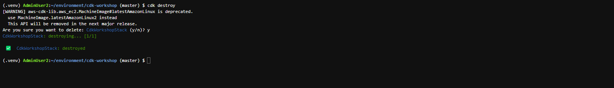

 
#### Dọn dẹp tài nguyên

Chúc mừng bạn đã hoàn thành workshop cơ bản về CDK. Để tổng kết, bạn đã

- Cài đặt và làm quen với CDK CLI
- Sử dụng CDK để triển khai một infrastructure đơn giản, bao gồm
    - VPC
    - Public subnet
    - EC2 instance
    - Role và Security group
    - Cài đặt apache trên EC2 instance thông qua user data

Đừng quên xoá các tài nguyên đã tạo. Có hai cách bạn có thể thực hiện để dọn dẹp các tài nguyên:

- Xoá CloudFormation stack trên AWS console
- Sử dụng CDK CLI để xoá stack

```
cdk destroy
```



- Sau đó nhớ xoá Cloud9 Instance sau khi xoá CDK stack bạn nhé.